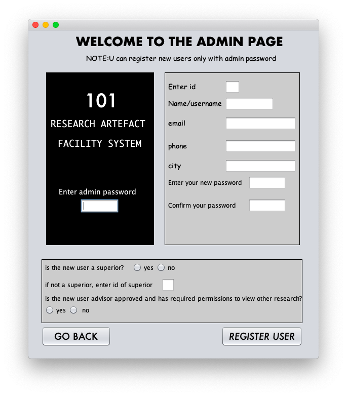
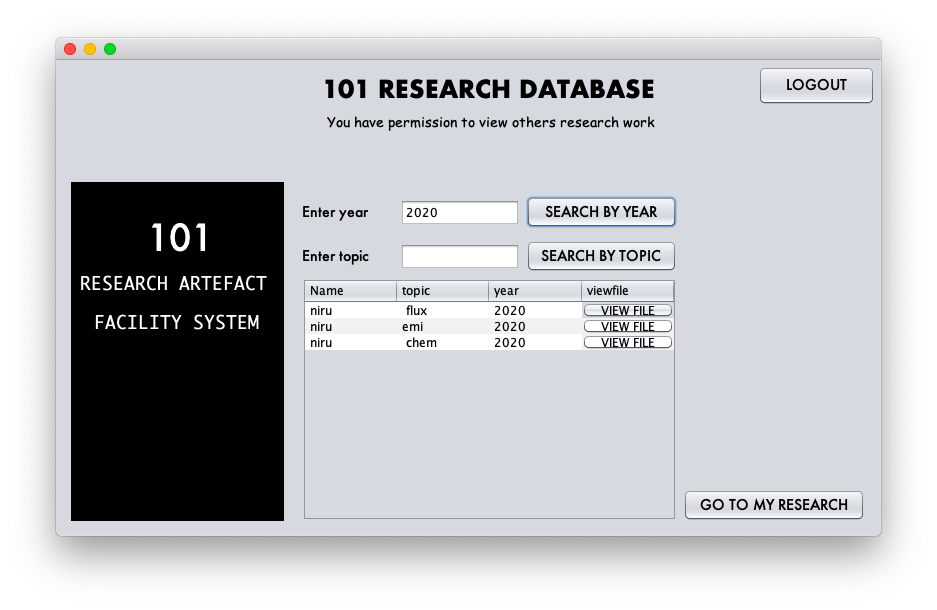
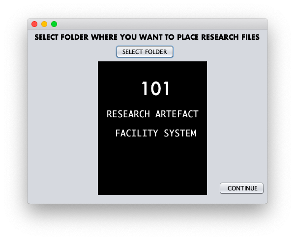
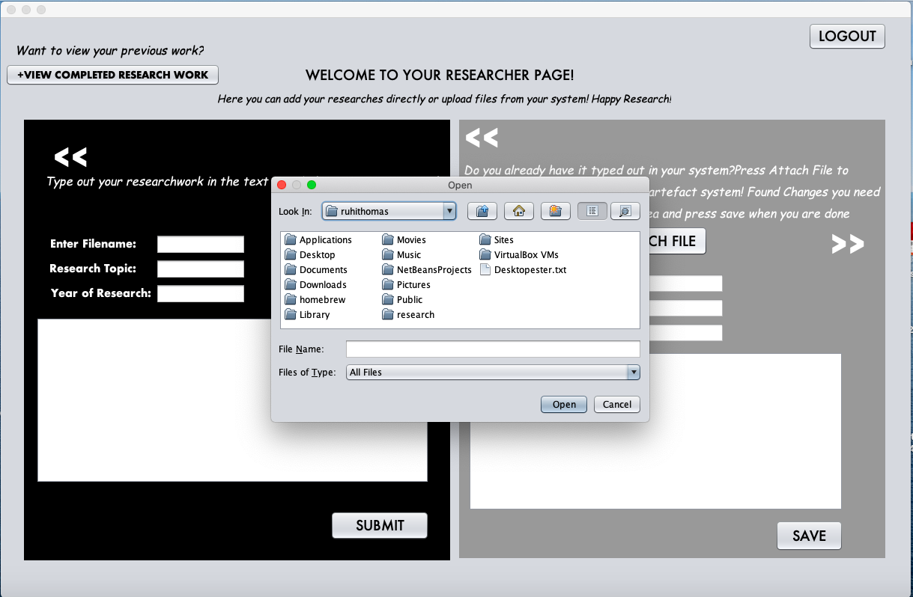
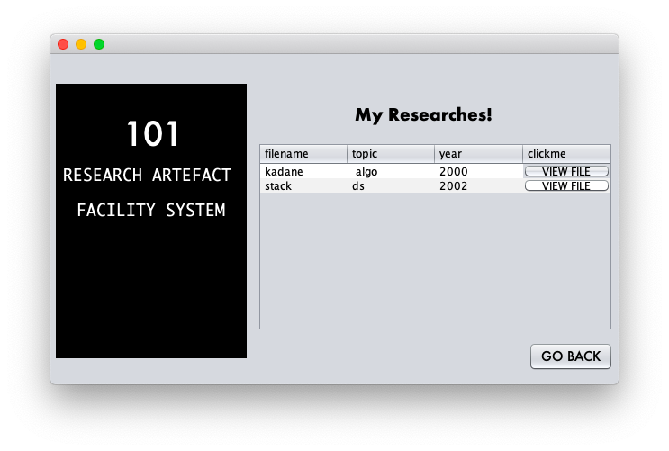
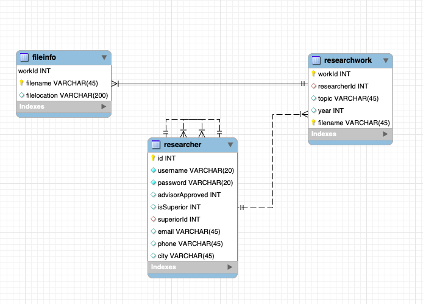
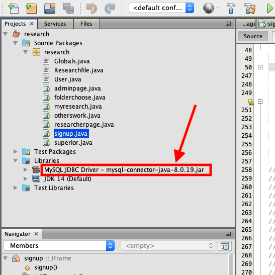
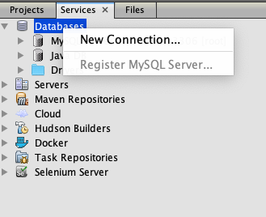
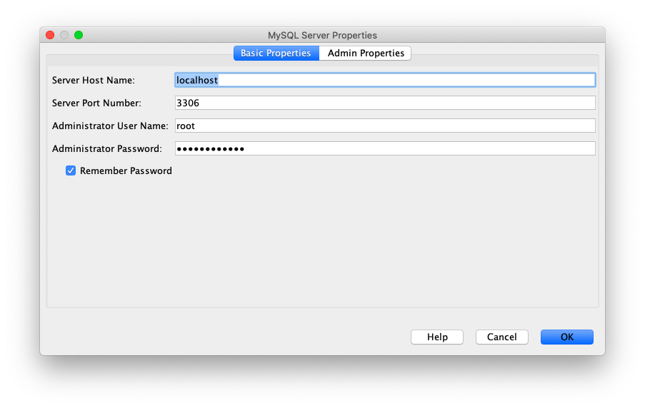
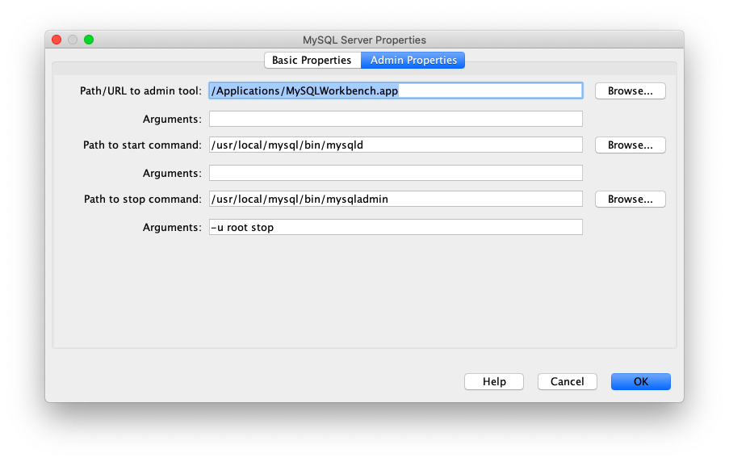

# 101 Research Artefact Facility System

The application provides facilities for researchers to store and access their research data with ease ,for superiors to monitor their subordinate works and for researchers with advisor approval to view all researches in the 101 Research Artefact Facility System!

## Build status


## Output Screenshots












## Frameworks used

Built with [NetBeans](https://netbeans.org/features/java/index.html) framework

## Features

* Simple and interactive GUI
* Only those researchers who have been permitted by superiors can the access the system. 
* Researchers can view previously developed artefacts \(such as reports, published papers etc\) by year or by topic.
* Researchers can open and read the contents of the corresponding file by providing file information \(such as file no\).
* Researcher is able to update his/her research information relevant to his work and upload files.
* Superiors of a particular researcher can to view his/her subordinates research updates
* Details regarding research must be stored in corresponding background tables including relevant files and file uploaded is maintained at a disk location

## Class Diagram



#### ACTORS

* researcher 
* superior 
* admin

#### USE CASES

* researcher

  * add research file
  * upload research files
  * view previous research work
  * if advisor approved; can view and search all research work in facility database

* superior
  * view research of subordinates
* admin
  * can register users

## INSTALLATION

1. Install 
   * [Java SE Development Kit 8 \(JDK 8\)](http://www.oracle.com/technetwork/java/javase/downloads/jdk8-downloads-2133151.html)
   *  [NetBeans IDE](https://netbeans.org/downloads/)
   * [MySQL](https://www.mysql.com)
   * \*\*\*\*[**Connector/J 8.0.19**](https://dev.mysql.com/downloads/connector/j/)\*\*\*\*
   * [MySQL Workbench](https://dev.mysql.com/downloads/workbench/) \(or anyother database as per convenience\)
2. Set up database as shown in class diagram.  Create a schema named `researchartefact` .Use the SQL commands below to CREATE TABLES 
3. Clone the project in your system and open using Netbeans.
4. Connect with the `researchartefact` database properly \(steps vary depending on your system\)
5. Run signup.java file and it works!

```sql
CREATE TABLE `researcher` (
  `id` int NOT NULL,
  `username` varchar(20) COLLATE utf8_bin NOT NULL,
  `password` varchar(20) COLLATE utf8_bin NOT NULL,
  `advisorApproved` int DEFAULT NULL,
  `isSuperior` int DEFAULT NULL,
  `superiorId` int DEFAULT NULL,
  `email` varchar(45) COLLATE utf8_bin DEFAULT NULL,
  `phone` varchar(45) COLLATE utf8_bin DEFAULT NULL,
  `city` varchar(45) COLLATE utf8_bin DEFAULT NULL,
  PRIMARY KEY (`id`),
  UNIQUE KEY `id_UNIQUE` (`id`),
  UNIQUE KEY `username_UNIQUE` (`username`),
  KEY `superiorId` (`superiorId`),
  CONSTRAINT `researcher_ibfk_1` FOREIGN KEY (`superiorId`) REFERENCES `researcher` (`id`),
  CONSTRAINT `researcher_ibfk_2` FOREIGN KEY (`superiorId`) REFERENCES `researcher` (`id`)
) ENGINE=InnoDB DEFAULT CHARSET=utf8 COLLATE=utf8_bin
```

```sql
CREATE TABLE `researchwork` (
  `workId` int NOT NULL AUTO_INCREMENT,
  `researcherId` int DEFAULT NULL,
  `topic` varchar(45) COLLATE utf8_bin DEFAULT NULL,
  `year` int DEFAULT NULL,
  `filename` varchar(45) COLLATE utf8_bin NOT NULL,
  PRIMARY KEY (`workId`,`filename`),
  KEY `id_idx` (`researcherId`),
  CONSTRAINT `researchwork_ibfk_1` FOREIGN KEY (`researcherId`) REFERENCES `researcher` (`id`)
) ENGINE=InnoDB AUTO_INCREMENT=18 DEFAULT CHARSET=utf8 COLLATE=utf8_bin
```

```sql
CREATE TABLE `fileinfo` (
  `workId` int NOT NULL AUTO_INCREMENT,
  `filename` varchar(45) COLLATE utf8_bin NOT NULL,
  `filelocation` varchar(200) COLLATE utf8_bin DEFAULT NULL,
  PRIMARY KEY (`workId`,`filename`),
  UNIQUE KEY `filename_UNIQUE` (`filename`),
  CONSTRAINT `fileinfo_ibfk_1` FOREIGN KEY (`workId`) REFERENCES `researchwork` (`workId`)
) ENGINE=InnoDB AUTO_INCREMENT=18 DEFAULT CHARSET=utf8 COLLATE=utf8_bin
```

 


 Make sure you have the JDBC MySQL connector installed in the Libraries folder of the project with correct path.





Make sure that MySQL server is running in localhost:3306\(most cases in port 3306\) and setup that connection by going to Services Tab-&gt;Databases-&gt;Regsiter MySQL Server





Select the MySQL driver in the prompt and give correct path to the .jar file\(example filename -mysql-connector-java-8.0.19.jar\).Refer images below for more help.






## NOTE




1. The password for administrators to register user is admin
2. The  **getConnection\(String url\)** method of Java DriverManager which establishes connection with the database has to be changed according to your system.Instructions on where to change is given in comment section of all .java files


## AUTHOR


## LICENSE

[](https://github.com/stratospher/Research-Artefact-Access-System/blob/master/LICENSE)Copyright \(c\) 2020 Ruhi Thomas

